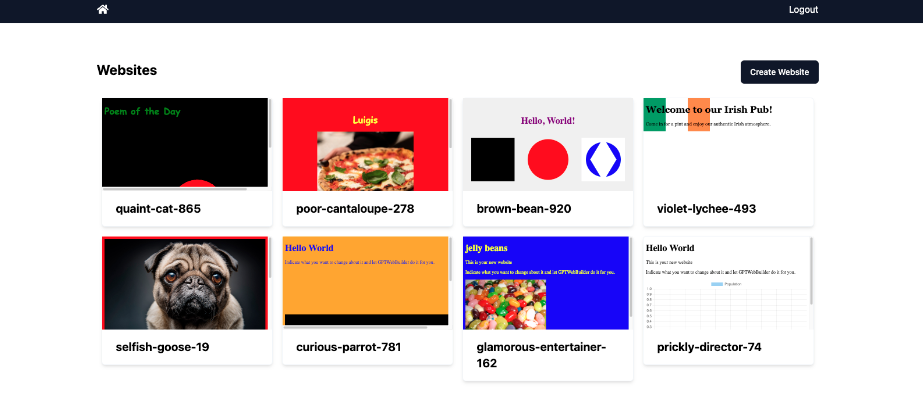

This is a new note. As you can see, this is what we are doing here are and it works pretty well.

Interesting here.

they are getting rid of Bard

this is a personal photo

new line

this is not a new line

interesting

tew

.png "demo-img(1).png")another test

this is a test

ok great! very cool!